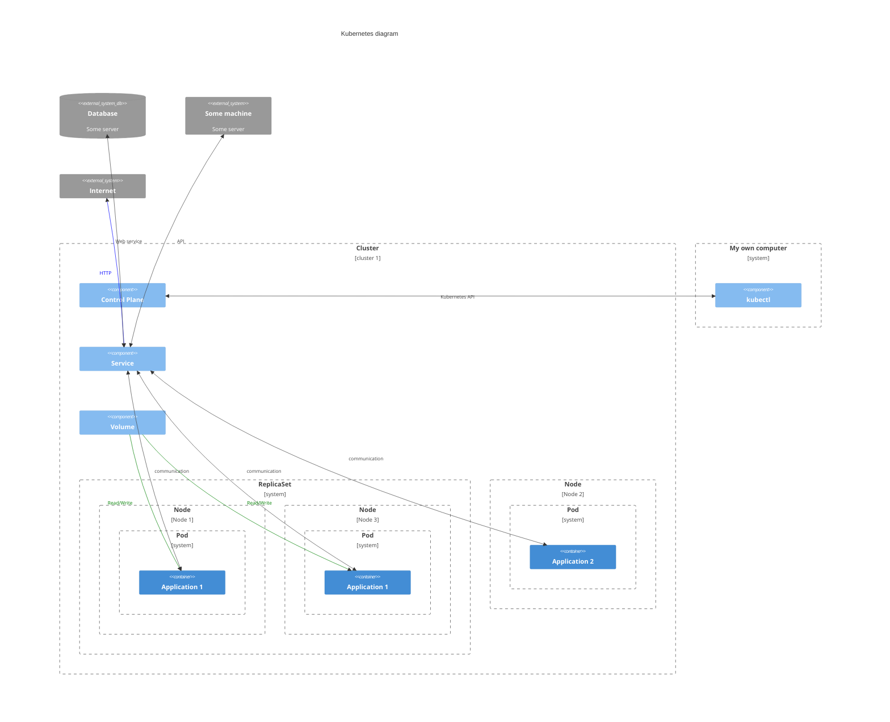

```mermaid

C4Component
title Kubernetes diagram

Boundary(cluster1, "Cluster", "cluster 1") {

  Boundary(rset1, "ReplicaSet") {
    Boundary(node1, "Node", "Node 1") {
      Boundary(pod1, "Pod") {
        Container(app1, "Application 1")
      }
    }

    Boundary(node3, "Node", "Node 3") {
      Boundary(pod3, "Pod") {
        Container(app3, "Application 1")
      }
    }
  }

  Boundary(node2, "Node", "Node 2") {
    Boundary(pod2, "Pod") {
      Container(app2, "Application 2")
    }
  }

  

  Component(cplane, "Control Plane")
  Component(service1, "Service")
  Component(volume1, "Volume")
}

Boundary(mycomp, "My own computer") {
  Component(kubectl, "kubectl")
}

SystemDb_Ext(machine1, "Database", "Some server")
System_Ext(machine2, "Some machine", "Some server")
System_Ext(internet, "Internet")

BiRel(kubectl, cplane, "Kubernetes API")

BiRel(service1, internet, "HTTP")
UpdateRelStyle(service1, internet, "blue", "blue", "-40")
BiRel(service1, machine1, "Web service")
UpdateRelStyle(app1, machine1, "red", "red", "40", "60")
BiRel(service1, machine2, "API")

BiRel(service1, app1, "communication")
BiRel(service1, app2, "communication")
BiRel(service1, app3, "communication")

Rel(volume1, app1, "Read/Write")
UpdateRelStyle(volume1, app1, "green", "green", "-120")
Rel(volume1, app3, "Read/Write")
UpdateRelStyle(volume1, app3, "green", "green")
```
